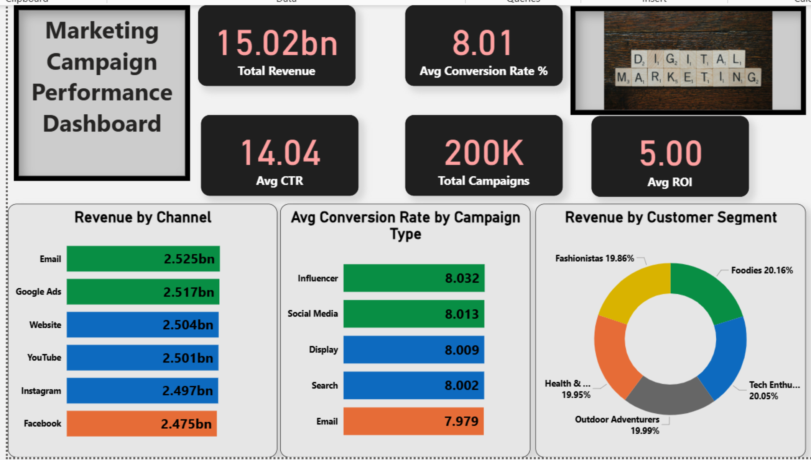
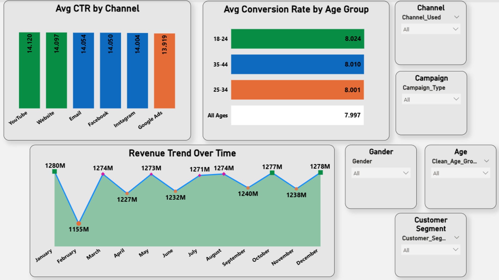
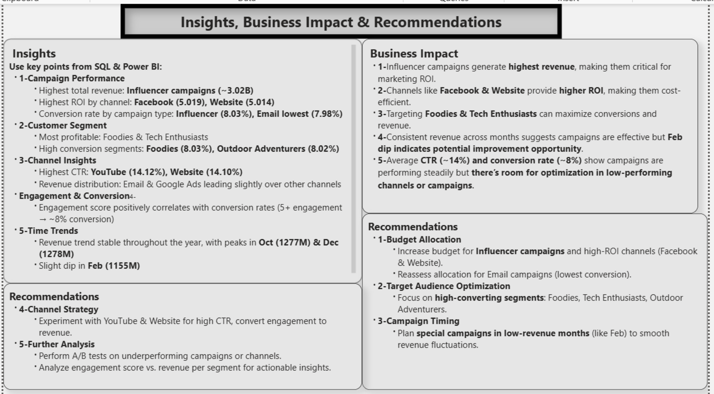

# Marketing_Campaign_Analysis
End-to-end project analyzing marketing campaigns to optimize conversion rates and ROI. Includes Python data cleaning, SQL exploration, A/B testing, and Power BI dashboards with insights, business impact, and recommendations.

  
  
  

---

## Project Overview
Companies invest significant budgets in marketing campaigns across multiple channels, but not all campaigns perform equally.  

This project helps to:  
- Analyze campaign performance by channel, type, and customer segment  
- Measure ROI, CTR, conversion rates, and total revenue  
- Perform A/B testing to determine the most effective campaigns  
- Provide actionable business insights and recommendations  

---

## Dataset 📊
The dataset used in this project is publicly available:  
[Marketing Campaign Dataset](https://www.kaggle.com/datasets/guelmaniloubna/marketing-campaign-dataset)  

---

## Folder Structure
Marketing_Campaign_Analysis/
│
├── Python/ # Python scripts & notebooks for analysis
├── SQL/ # SQL scripts & queries
├── PowerBI/ # Power BI dashboard file
└── Screenshots/ # Screenshots of analysis & dashboard

---

## Key Metrics
- **Total Revenue:** 15.02B  
- **Average Conversion Rate:** 8.01%  
- **Total Campaigns:** 200,005  
- **Average CTR:** 14.04%  
- **Average ROI:** 5  

---

## Power BI Visualizations
**Bar Charts:**  
1. Revenue by Channel  
2. Average Conversion Rate by Campaign Type  
3. Average Conversion Rate by Age Group  

**Donut Chart:** Revenue by Customer Segment  

**Column Chart:** Average CTR by Channel  

**Line Chart:** Revenue trend over months  

**Slicers:** Channel Used, Age Group, Gender, Customer Segment, Campaign Type  

---

## A/B Testing Results
**Email vs Social Media Campaigns:**  
- No significant difference in conversion rates  
- Budget can be allocated across both channels  

**Google Ads vs Facebook Campaigns:**  
- No significant difference in conversion rates  
- Focus on other factors like campaign type, duration, and target audience  

---

## Screenshots 📸

**Dashboard Overview**  
  

**Advance Analysis**  
  

**Insights, Business Impact & Recommendations**  
  

---

## Business Insights & Recommendations
- **Top Campaign Types:** Influencer & Social Media campaigns have higher conversion rates  
- **Top Channels by Revenue:** Email, Google Ads, Website  
- **High-Value Segments:** Foodies & Tech Enthusiasts show higher ROI  
- **Campaign Optimization:**  
  - Allocate budget across top-performing campaigns and channels  
  - Target high-value customer segments for higher ROI  
  - Use engagement scores and campaign duration to optimize campaigns  

